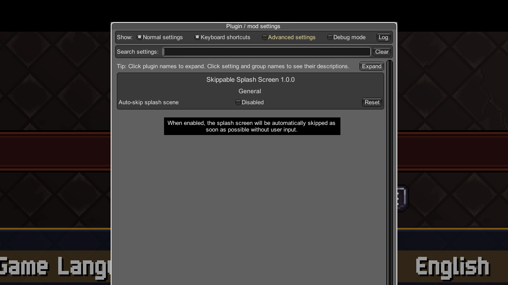

# Skippable Splash Screen for Chained Echoes

Ever started up Chained Echoes and wished you could skip the splash screen? Well, now you can!

## Features

By default, installing Skippable Splash Screen enables you to press any key on any input to skip the splash screen as fast as is possible. A prompt appears at the bottom of the screen when Skippable Splash Screen is ready to skip.

It can also be configured to automatically skip the splash screen without any input, if preferred.

## Installation

1. Install [BepInEx for Chained Echoes](https://github.com/toebeann/BepInEx.ChainedEchoes)

    BepInEx is a mod loader for Chained Echoes

2. Optionally install [Configuration Manager](https://github.com/BepInEx/BepInEx.ConfigurationManager)

    Configuration Manager allows you to modify Skippable Splash Screen's configuration in-game rather than editing .cfg files by hand.

3. Download and extract the contents of `Skippable Splash Screen.zip` into `<game folder>\BepInEx`.

    If you did it right, `Tobey.ChainedEchoes.SkippableSplashScreen.dll` should be located within `<game folder>\BepInEx\plugins`.

4. Launch the game and enjoy being able to skip!

If you would like to enable auto-skip (off by default), see [Configuration](#configuration) below:

## Configuration

Assuming you have installed [Configuration Manager](https://github.com/BepInEx/BepInEx.ConfigurationManager), configuration is a breeze. Simply press F1 once the game has launched to change the settings as you wish.

Otherwise, you'll have to run the game once to generate the `<game folder>\BepInEx\config\Tobey.ChainedEchoes.SkippableSplashScreen.cfg` file, which you will want to edit with your preferred text editor. I personally recommend [Visual Studio Code](https://code.visualstudio.com/).

### Options

Currently, there is only one option to configure in Skippable Splash Screen:

- `Auto-skip splash scene = false`
  
  When enabled, the splash screen will be automatically skipped as soon as possible without the need to press a button.
